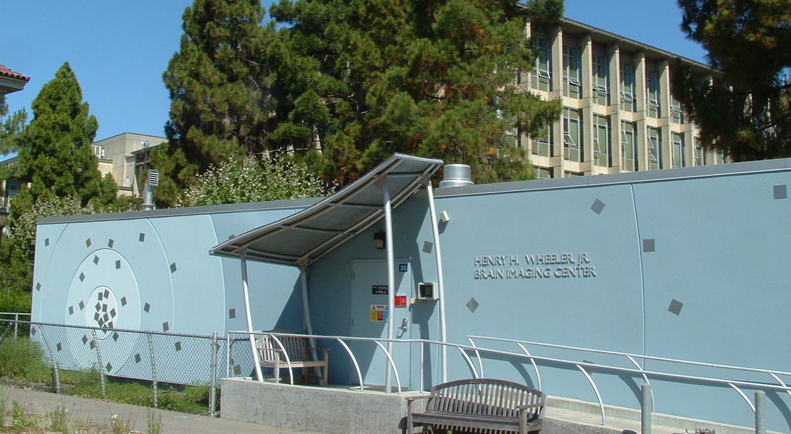
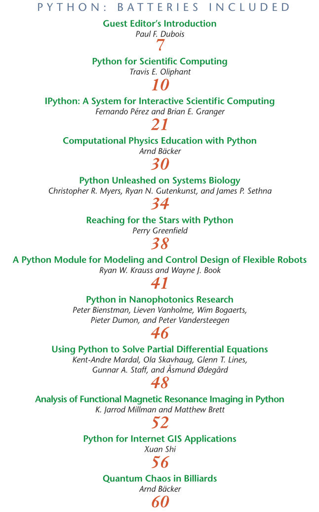
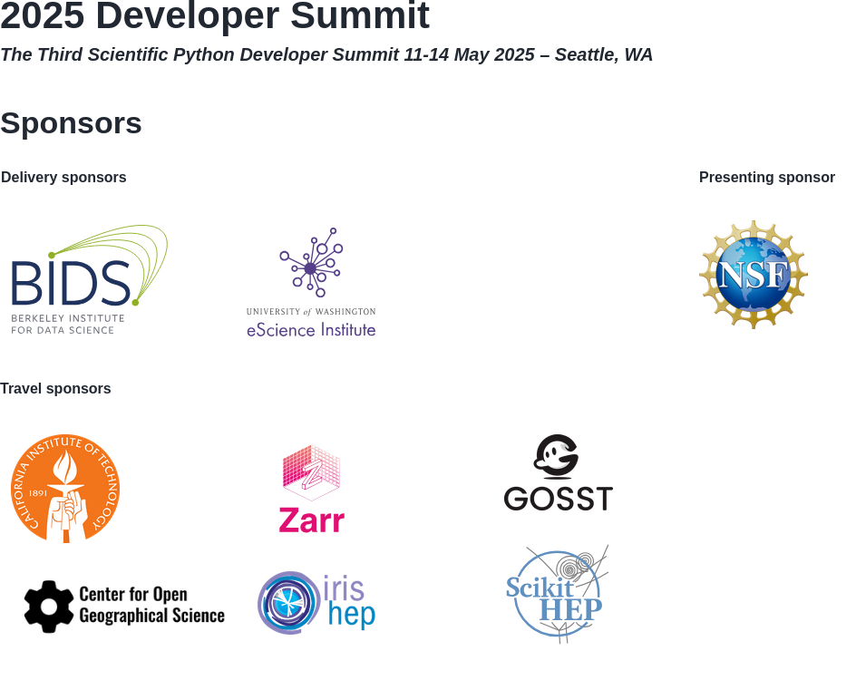
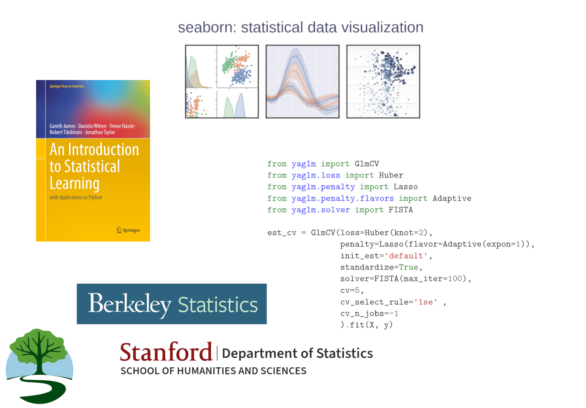

&nbsp;&nbsp; Scientific Python

BIDS, CDSS, & Berkeley

 
 

### Why?
### How?
### What?

 
 
 
 

---

# Why?

 

### Why open source / open science?
### Why Scientific Python?
### Why Berkeley / BIDS?

 
 
 
 

...

Notes:

- Lab created code, personal scripts, home-developed infrastructure (e.g., job scheduler)
- Scripts and libraries written in multiple languages
  (IDL, Matlab, C, Perl, Awk, etc.)
- Pushed the limits of existing hardware
- Switching from proprietary Unix to Linux

...

# Is there a better way?

...

...

...

...

> We believe that neuroscience ideas and analysis develop
> together.
> Good ideas come from understanding; understanding comes
> from clarity, and clarity must come from well-designed teaching
> materials and well-designed software.
> The software must be designed
> as a natural extension of the underlying ideas.
>
http://nipy.org/nipy/mission.html

...

## A Spark At Berkeley

### 2003–2012

Notes:

- Python not serious alternative to Matlab / IDL
- 04 meet FP, JT, JH, TP, PG, et al
- 05 course Tolman Hall by FP and JH
- 08 Fernando appointed at the BIC
- 10 SciPy India. meet Stéfan, US SciPy conference proceedings
- Josh Bloom, Python bootcamp, AY250

...

...

...

> In 2024,  Python overtook JavaScript as the  most popular language on GitHub,
> while Jupyter Notebooks skyrocketed—both of which underscore the surge in 
> data science and machine learning on GitHub.

https://github.blog/news-insights/octoverse/octoverse-2024/

Notes:

- the Data Science curriculum is launched, built around Python.
- statistical computing taught in Python

---

# How?

 

### How did this impact Berkeley and the World?
### How does the ecosystem work?
### How did this happen? 

 
 
 
 

...

# Impact

- Scientific Research
- Education and Workforce Development
- Economic Growth and Innovation
- National Security

...

https://jupytearth.org/jupyter-resources/introduction/ecosystem.html

...

...

...

 

### 📜 Principles
### 🚜 Practices
### 🤸🏿   People

...

## Principles

 

- community developed, and community owned
- importance of language and library choices

Notes:

- This is the best way to align incentives for doing good quality, transparent, reproducible science
- We believe that researchers know their needs best
- Their ideas must be surfaced and integrated into the computational
  platform as efficiently as possible
- In this endeavor, making money for shareholders is at best a
  distraction
  - But often, it incentivises entirely the wrong things: hardware
    locks, license servers, closed file formats
  - Incentive to lock users into  proprietary systems
    - This prohibits sharing, reproducibility, and transparency

- Transparency: you *should* always be able to investigate the
  *entire* scientific stack.
- To know answers are accurate, you have to be able to look under the
  hood.
- You also need to be able to modify tools to do *new things*, to do
  *whatever* needs to be done.
- The change required is bigger than just open software; you need
  reproducible research as well (i.e. data/methods publishing). But
  it's a start.

- The **importance of language and library choices** cannot be underestimated.

- General-purpose
- Readable code
- Prioritize human (not computer) time

- Re-emphasises the notion of a user-developer
- Library interfaces and language clarity / expressivity matter: it's
  how we express our thoughts.

...

## Practices

 

**Technical**

- Revision control
- Testing / continuous integration
- Code review
- Documentation
- Iteration

**Social**

- Governance and Coordination

Notes:

No matter how sound philosophy, we still need working code!

<!-- Code review both during development cycle, but also during use where
users can easily introspect for problems. -->

<!-- Documentation has to stay in sync with code (docstrings). -->

...

## People

 

Notes:

- Work done in collaboration is better and more fun.

  - **Community** is meaningful.
  - **Culture** is important for good work.
  - **Leadership** sets direction.
  - **Governance** sets expectations and reduces misunderstandings.

- Community

  - Many of my best friends I made through this ecosystem.

  - These have been the most fulfilling and educational collaborations
    of my life.

  - Being part of a movement where everyone is aligned is incredibly
    exciting.

  - For me, personally, it's been transformative to my career. Lots of
    people have helped me get where I am today.

- Culture

  - In a volunteer effort you cannot afford *not* to treat people
    well

  - Unsurprisingly, when people feel welcome, listened to, engaged, they produce
    better work

- Leadership

  - It helps greatly when the founders of projects set the right tone;
    one of the things that drew me into SP from the beginning

    - Various projects had you earn your badge
    - SP phone call from Berkeley: trust placed in newcomers,
      welcomed with open arms, treated with respect (listen to opinions)

---

# What?

 

### What is the scientific python project?
### What is BIDS' / Berkeley's role?
### What comes next? 

 
 
 
 

...

...

...

...

...

...

...

...

...

# AI

---

