

Unlocking Academic Innovation: 
Open Source, Open Science, and Open Scholarship

 

 
 
 

Jarrod Millman 
Executive Director, Open Source Program Office 
UC Berkeley

Notes:

Abstract:
This talk introduces the concept of an Open Source Program Office (OSPO) within an academic setting, highlighting its benefits for students, faculty, and researchers.
By exploring the intersection of open source software and open science, I will discuss the challenges and opportunities that arise at the nexus of academia and open source, and how OSPOs can address these by enhancing collaboration, reducing costs, and increasing funding opportunities. Key examples from influential open source ecosystems like Linux, Jupyter, and Scientific Python will be presented. Additionally, this presentation will share experiences from UC Berkeley's OSPO and open a discussion on potential collaborations between UT Dallas and UC Berkeley, while promoting the potential for establishing a UT-wide Network of OSPOs.

Intended Audience:

- High-Level Decision Makers: Deans, department heads, and other administrators interested in innovation and strategic partnerships.
- Technology Transfer Office: Individuals involved in managing intellectual property and technology licensing.
- Campus CIO: Chief Information Officers responsible for overseeing IT strategies and infrastructure.
- Faculty and Students: Those interested in open source software, open science, and the role of university OSPOs in advancing academic research and collaboration.

---

## Overview

- Background and Motivation
- Scientific Python and Jupyter
- Berkeley Institute for Data Science
- Lessons, Challenges, and Opportunities

---

# Background and Motivation

...

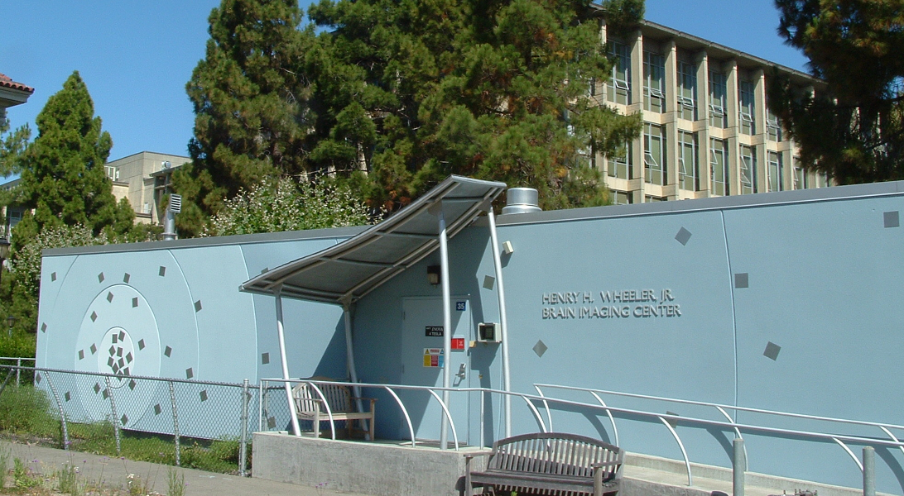

Notes:

- Lab created code, personal scripts, home-developed infrastructure (e.g., job scheduler)
- Scripts and libraries written in multiple languages
  (IDL, Matlab, C, Perl, Awk, etc.)
- Pushed the limits of existing hardware
- Switching from proprietary Unix to Linux

...

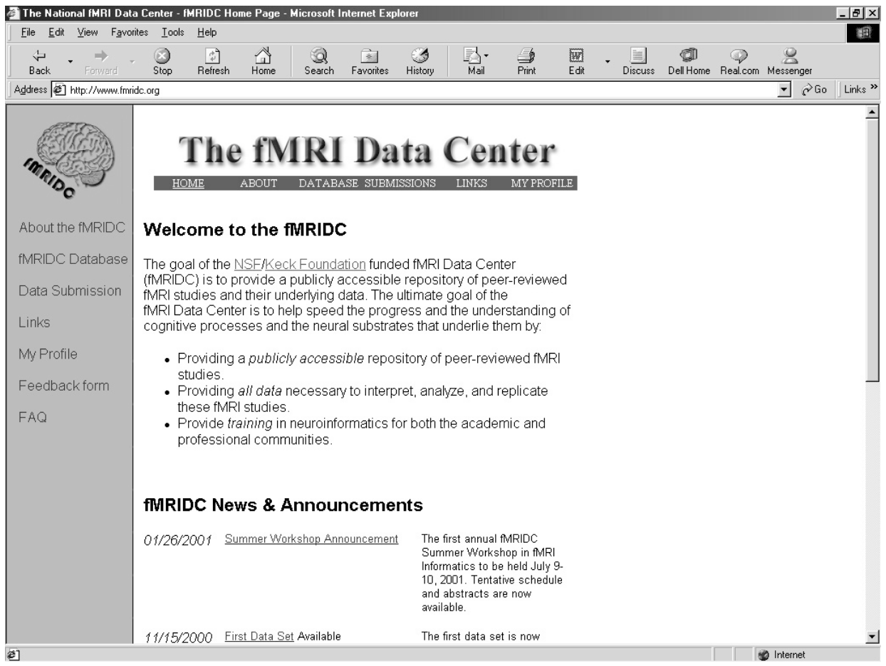

...

# Is there a better way?

...

## Linux

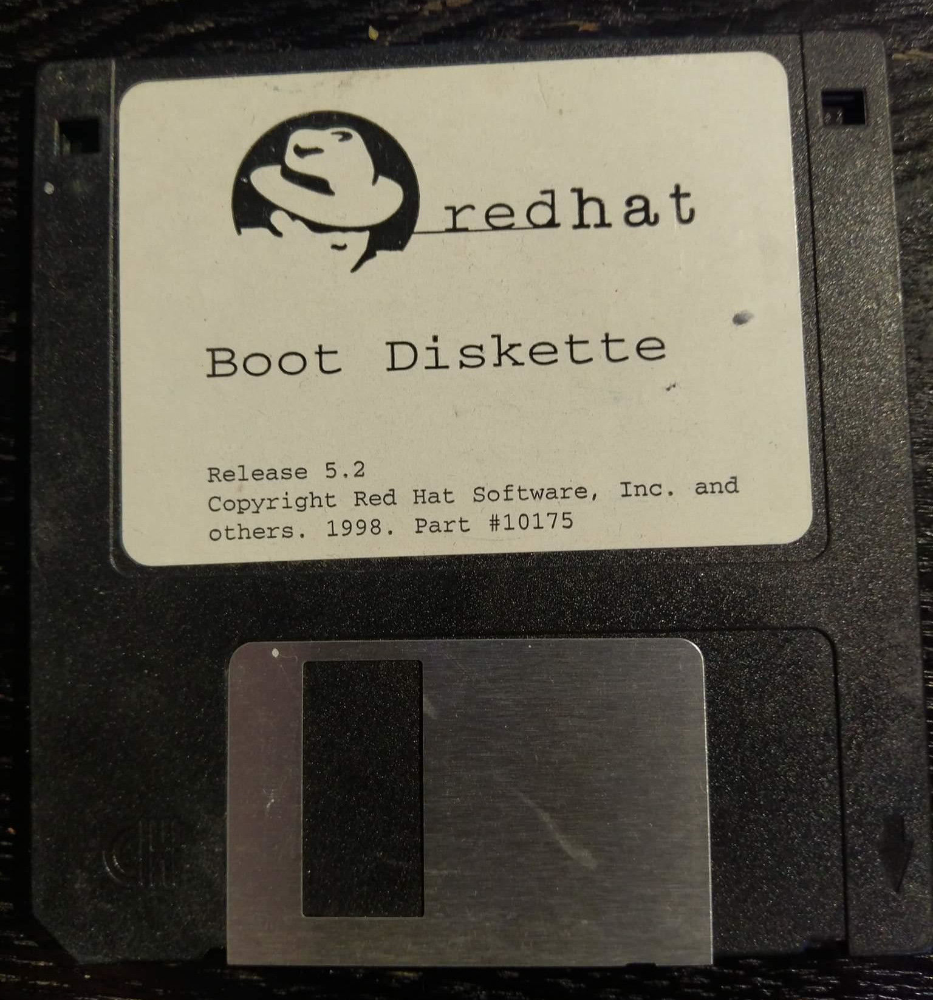

...

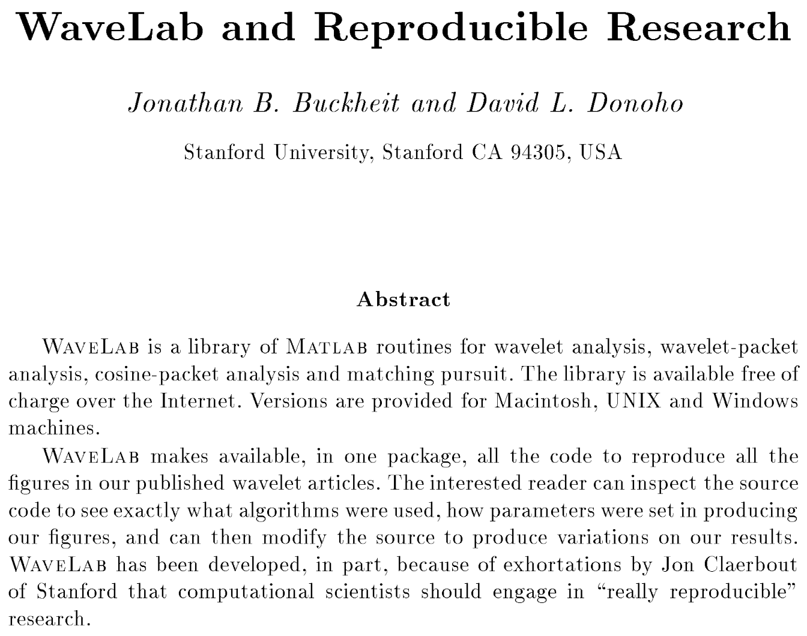

...

...

## Neuroimaging in Python

> We believe that neuroscience ideas and analysis develop
> together.
> Good ideas come from understanding; understanding comes
> from clarity, and clarity must come from well-designed teaching
> materials and well-designed software.
> The software must be designed
> as a natural extension of the underlying ideas.
>
http://nipy.org/nipy/mission.html

---

# Scientific Python and Jupyter

...

## A Spark At Berkeley

### 2003–2012

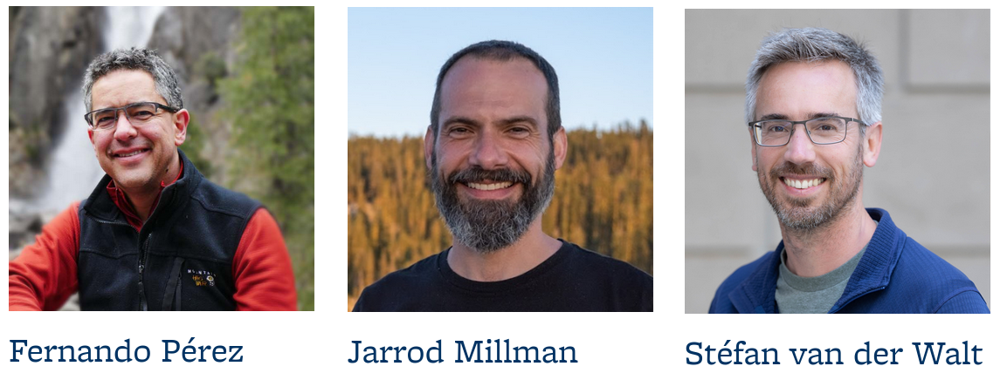

Notes:

- Python wasn't really a serious alternative to Matlab / IDL
- 2004 meeting Jonathan, John (ECoG), Fernando, Travis, Perry, et al
- 2005, first course on campus, and probably *one of the* earliest
  courses anywhere, was given in Tolman Hall by Fernando and John.
- 2008, Fernando is appointed at the BIC
- 2010 I co-organizes SciPy India. meets Stéfan, US SciPy conference proceedings
- Josh Bloom, annual Python bootcamp and the AY250 course

...

...

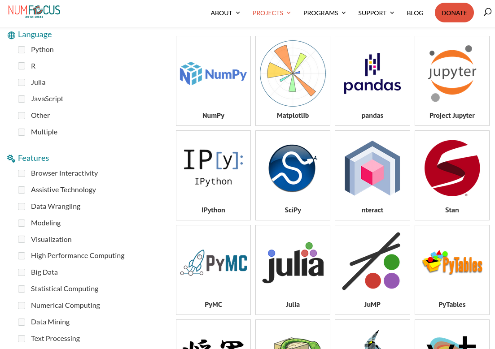

...

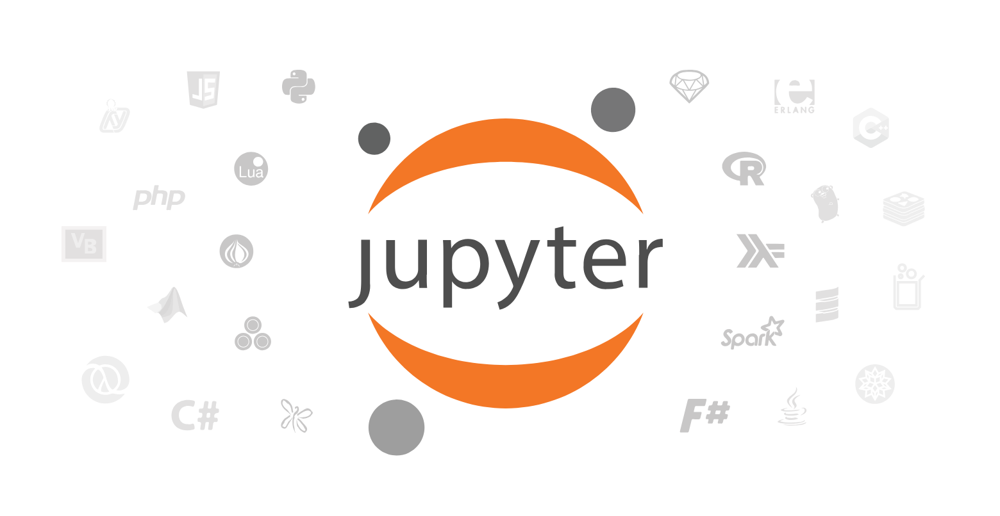

...

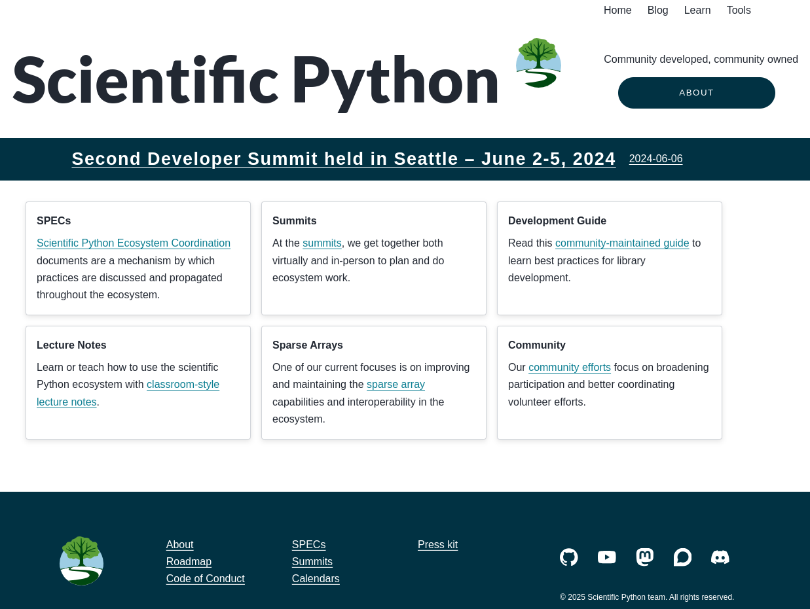

...

> In 2024, Python overtook JavaScript as the most popular language on GitHub,
> while Jupyter Notebooks skyrocketed—both of which underscore the surge in
> data science and machine learning on GitHub.

https://github.blog/news-insights/octoverse/octoverse-2024/

Notes:

- the Data Science curriculum is launched, built around Python.
- statistical computing taught in Python

---

# Berkeley Institute for Data Science

Notes:

- Now Fernando, Stefan, and I are at BIDS

...

> Our scientists partner with an extended, distributed **community** of
> other researchers and developers to **build** an **ecosystem** that benefits
> **all**. This is how we will build much more in coming years: work
> grounded in the **expertise** of our scholars and immediately **applied** to
> our research and educational needs, but in **open collaboration** with
> partners near and far, to build **access** to **research** and **education**
> that is **impactful**, **accessible**, and **fair**.

https://bids.berkeley.edu/about/directors-vision-2024

Notes:

A renewed emphasis of the importance of open software and research:

- In 2024, Fernando become BIDS faculty director
- In 2025, Kirstie joins BIDS as ED

...

### https://ospo.berkeley.edu/

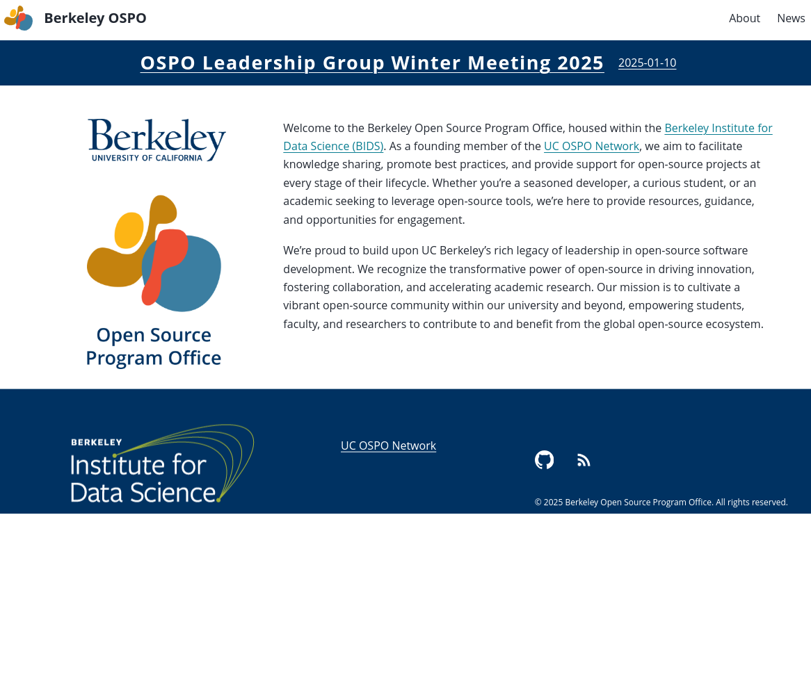

Notes:
- funded late Spring 2024
- kick-off event May
- OSPO: an attachment-point for open source conversations on campus
- Areas we intend to work on:
- statistics in Python
- supply-chain security
- domain stacks (neuroscience, earth & space science, ...)
- coordinated releases
- summer schools
- vetted, shared governance models

... and more.

---

# Lessons, Challenges, and Opportunities

...

## Why adoption and growth so unusual

 

- Who developed the software?
- When, and with what?
- What did it replace?

Notes:

- Small handful of students, junior researchers, other volunteers
- Predominantly in their spare time, over weekends and evenings
- Often little to no financial support
- Against wishes / recommendations of many colleagues (not Ben!)

Competing against platforms built by companies with:

- Millions of dollars in funding
- Hundreds of dedicated programmers
- Pushes by big marketing teams, contracts with many corporations and universities

...

## Why it isn't surprising

 

📜 Principles &nbsp;&nbsp;&nbsp;&nbsp;&nbsp;
🚜 Practices &nbsp;&nbsp;&nbsp;&nbsp;&nbsp;
🤸🏿   People

...

## Principles

 

- Scientific software must be **community developed**, and **community owned**
- This is the best way to align incentives for doing good quality, transparent, reproducible science

Notes:

- We believe that researchers know their needs best
- Their ideas must be surfaced and integrated into the computational
  platform as efficiently as possible
- In this endeavor, making money for shareholders is at best a
  distraction
  - But often, it incentivises entirely the wrong things: hardware
    locks, license servers, closed file formats
  - Incentive to lock users into  proprietary systems
    - This prohibits sharing, reproducibility, and transparency

- Transparency: you *should* always be able to investigate the
  *entire* scientific stack.
- To know answers are accurate, you have to be able to look under the
  hood.
- You also need to be able to modify tools to do *new things*, to do
  *whatever* needs to be done.
- The change required is bigger than just open software; you need
  reproducible research as well (i.e. data/methods publishing). But
  it's a start.

...

## Principles (II)

 

The **importance of language and library choices** cannot be underestimated.

- General-purpose
- Readable code
- Prioritize human (not computer) time

Notes:

- Re-emphasises the notion of a user-developer
- Library interfaces and language clarity / expressivity matter: it's
  how we express our thoughts.

...

## Practices

 

**Technical**

- Revision control
- Testing / continuous integration
- Code review
- Documentation
- Iteration

**Social**

- Governance (*see also:* people)

Notes:

No matter how sound philosophy, we still need working code!

<!-- Code review both during development cycle, but also during use where
users can easily introspect for problems. -->

<!-- Documentation has to stay in sync with code (docstrings). -->

...

...

## People

 

Notes:

- Work done in collaboration is better and more fun.

  - **Community** is meaningful.
  - **Culture** is important for good work.
  - **Leadership** sets direction.
  - **Governance** sets expectations and reduces misunderstandings.

- Community

  - Many of my best friends I made through this ecosystem.

  - These have been the most fulfilling and educational collaborations
    of my life.

  - Being part of a movement where everyone is aligned is incredibly
    exciting.

  - For me, personally, it's been transformative to my career. Lots of
    people have helped me get where I am today.

- Culture

  - In a volunteer effort you cannot afford *not* to treat people
    well

  - Unsurprisingly, when people feel welcome, listened to, engaged, they produce
    better work

- Leadership

  - It helps greatly when the founders of projects set the right tone;
    one of the things that drew me into SP from the beginning

    - Various projects had you earn your badge
    - SP phone call from Berkeley: trust placed in newcomers,
      welcomed with open arms, treated with respect (listen to opinions)

...

## Challenges

 

- Developer time (review time)
- A lot of time-consuming training (GSoC, etc.)
- Funding
- Implications of receiving funding
- Coordination / cross-project decision making
- Unified user experience

Notes:

- Developer time
  - Very few full time like me
  - Contributor time varies (also: parents, breadwinners, etc.)

- We are doing a lot of training
  - Academia and industry both often use us to train people
  - That should be taught in universities / as professional courses

- Funding
  - No grant line items
  - Few company contributions
  - Mostly foundation-supported
    - Some grants, but need more and *longer term*

- Coordination
  - Used to be small (SciPy conf), now big
  - Nothing like project managers who can think about whole ecosystem,
    get user feedback, set up roadmaps, etc.
  - Coordination is haphazard

...

## Challenges

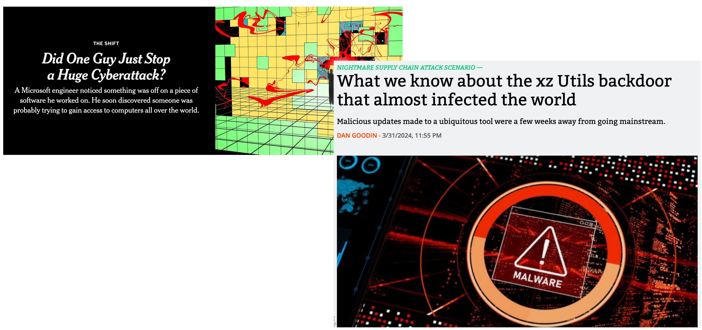

Notes:

- Large Language Models

  - Malicious Content Generation
  - Trust models

...

## Challenges

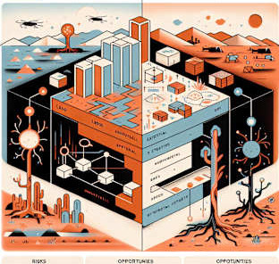

---

# Discussion

---

# Extra slides

...

## Open Source Program Office  OSPO

Notes:

- An open source program office (OSPO) serves as the center of competency for an organization's open source operations and structure.
  https://github.com/todogroup/ospodefinition.org

- An Open Source Program Office (OSPO) is a department formed by subject-matter experts involved in free and open software. 
  https://en.wikipedia.org/wiki/Open_Source_Program_Office

...

## Open Source Program Office

### In Industry

<blockquote>
"The Google Open Source Programs Office dates back to 2004, making it one of the first OSPOs in the industry."

—https://opensource.google/about
</blockquote>

Notes:
- to build on open source technologies and share Google-developed technology under open licenses
- Google Summer of Code in 2005
- Season of Docs in 2019
- 2023 several members of Google’s Open Source Programs Office were let go

...

### In Academia

<blockquote>
"Since 2020, the Alfred P. Sloan Foundation has been helping universities
establish Open Source Program Offices (OSPOs) as a strategy to institutionalize
support for open source software in research and beyond."

—https://sloan.org/programs/digital-technology/ospo-loi
</blockquote>

Notes:

- Johns Hopkins University 2021
- CURIOSS 2023
- 22 members 

...

### https://ucospo.net/

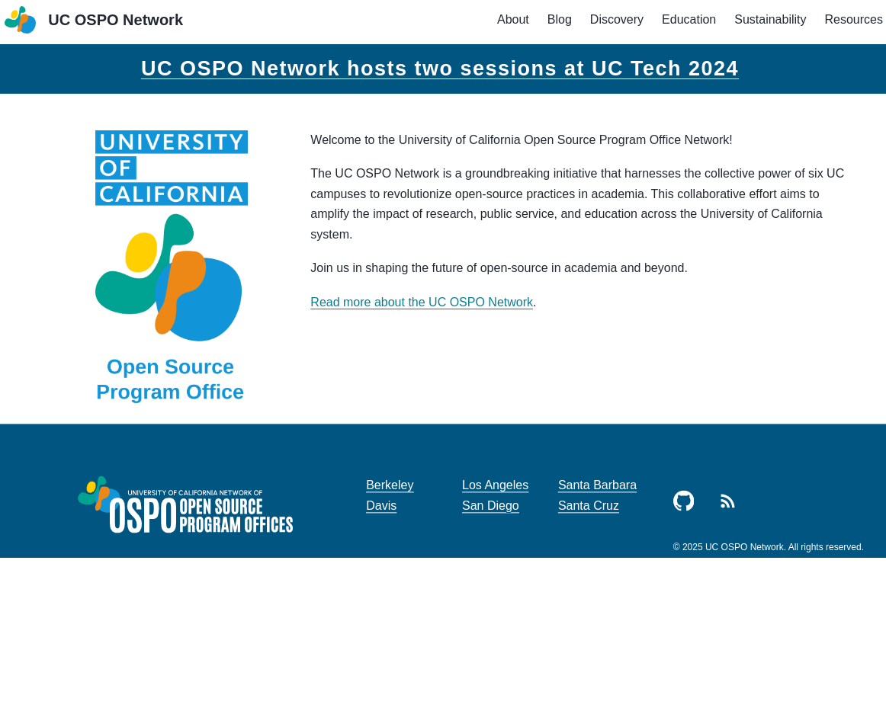

Notes:
- funded late Spring 2024
- kick-off event May

...

### https://ospo.berkeley.edu/

Notes:
- funded late Spring 2024
- kick-off event May

---

## On the horizon

[Open Source Project Office](https://bids.berkeley.edu/news/uc-berkeley-joins-effort-advance-open-source-initiatives-across-uc-system)

Areas we intend to work on:

- statistics in Python
- supply-chain security
- domain stacks (neuroscience, earth & space science, ...)
- coordinated releases
- summer schools
- vetted, shared governance models

... and more.

Notes:

- OSPO: an attachment-point for open source conversations on campus
- Areas we intend to work on:
- statistics in Python
- supply-chain security
- domain stacks (neuroscience, earth & space science, ...)
- coordinated releases
- summer schools
- vetted, shared governance models

and more.

## 2007: 1<small>st</small> CiSE Special Issue

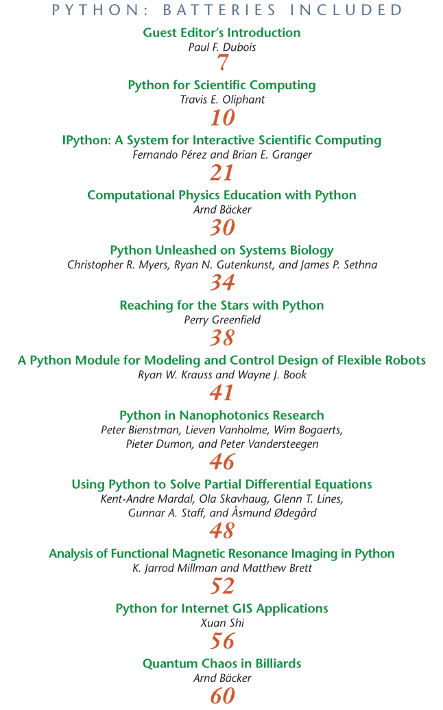

...

## 2007: 1<small>st</small> CiSE Special Issue

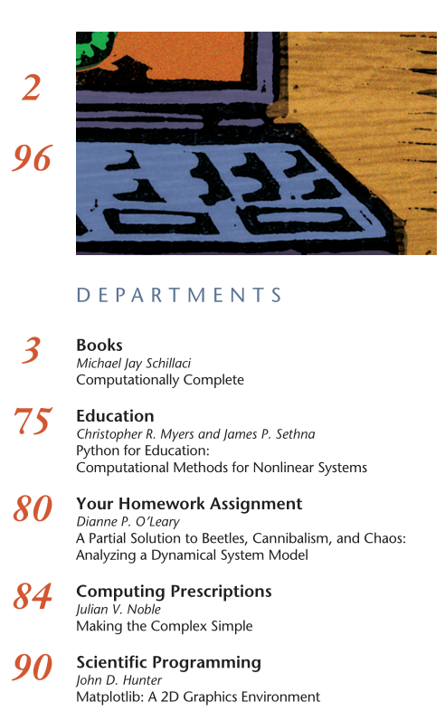

...

## 2008&ndash;2011: Growth of the SciPy Conference

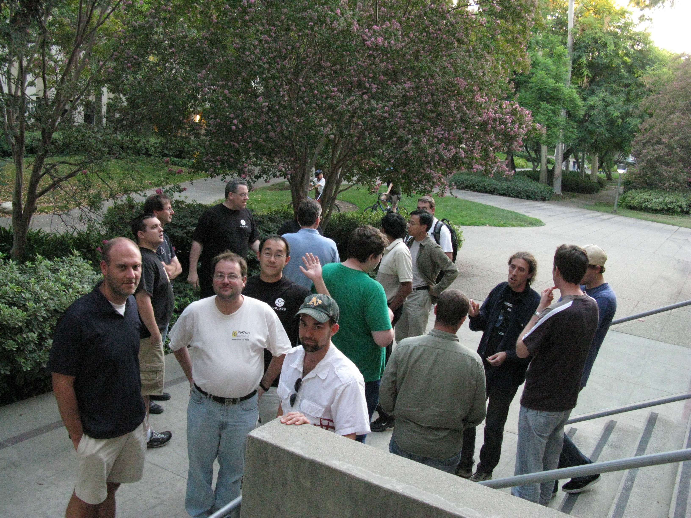

Note:

- < 100 participants
- > 800 participants
- Rock Auditorium has seating capacity of 100
...

## 2011: 2<small>nd</small> CiSE Special Issue

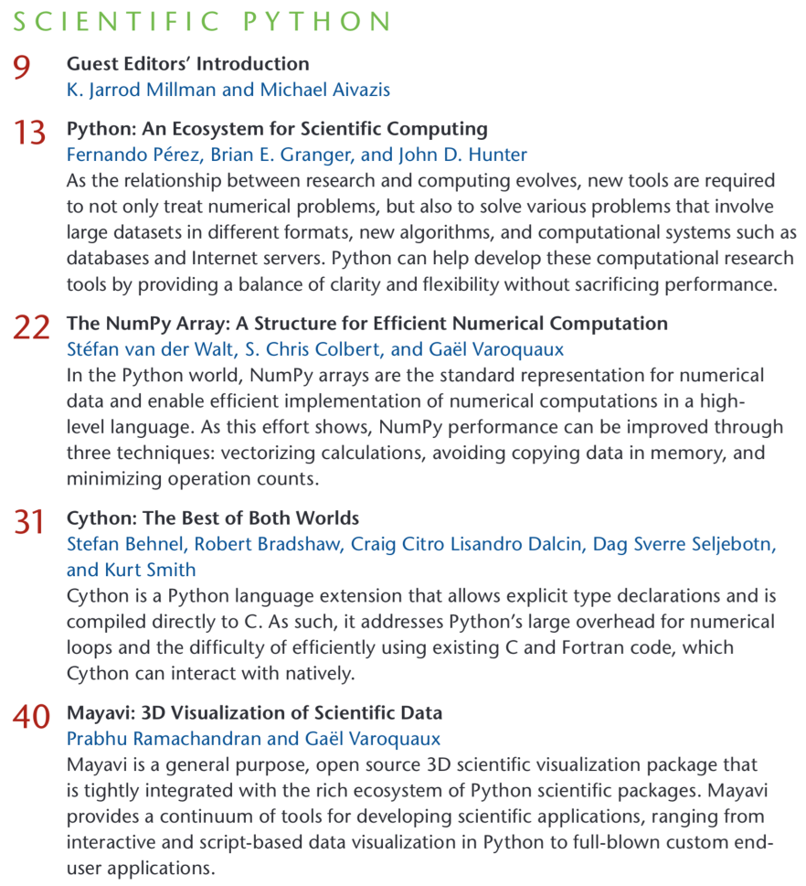

...

## Support

- Contribute or support students who want to
- Reward and recognize efforts outside of paper writing
- Fund open, not closed software (and convince funders to do the
  same!)
- Apply lessons from SP to your work
  1. Test research code
  2. Executable papers (AKA automate everything)
  3. Collaborate widely, credit all those involved
  4. Insist on open code & data (reviewing and publishing)

*Developing open source scientific practice* 
K. Jarrod Millman & Fernando Pérez 
https://www.jarrodmillman.com/oss-chapter.html

...

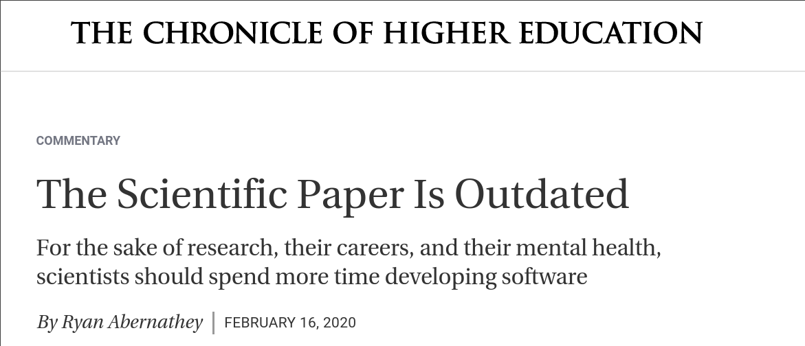

...

### Benefits for Contributors

- Advance science
- Make an impact
- Grow as a developer
- Shape the tools you use

You are very welcome to join!

